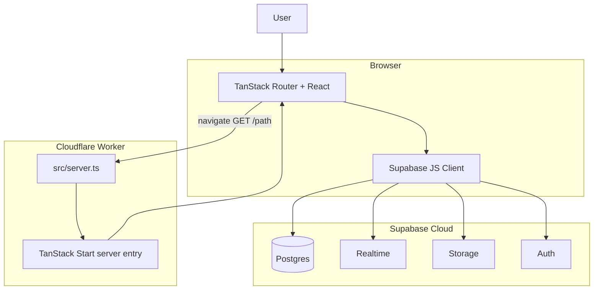

# SafetyFlux / Alertify — Project overview

This document describes the **tanstack_start_ts** codebase (product UI name: **Alertify**): where the "frontend" and "backend" live, which **routes** exist, which **libraries** are used, and how requests and data flow through the system.

---

## 1. What this project is

A **mobile-first web app** for **disaster awareness and emergency SOS**:

- **Home** (`/`): status dashboard shell (placeholder stats; copy mentions phased rollout).
- **Live map** (`/map`): Leaflet map with alert zones, optional user position and radius from preferences.
- **Alerts** (`/alerts`): Live list of disaster alerts with filtering by severity and distance.
- **SOS** (`/sos`): Signed-in users can submit an SOS with optional photo (Supabase Storage), severity, message, and coordinates.
- **Settings** (`/settings`): Account panel, Supabase-backed **user preferences** (radius, min severity, toggles).
- **Auth** (`/auth`): Email/password and **Google OAuth** via **Supabase Auth** (`signInWithOAuth`).

**There is no separate REST API service in this repo.** Persistent data and auth are provided by **Supabase** (PostgreSQL, Auth, Realtime, Storage). The only custom "server" code is the **TanStack Start SSR layer** running on **Cloudflare Workers** (see below).

---

## 2. Repository layout (where things live)

| Area | Path | Role |
|------|------|------|
| **App source** | `src/` | All application code (routes, components, hooks, integrations). |
| **File-based routes** | `src/routes/*.tsx` | TanStack Router routes; each file defines one URL segment. |
| **Generated route tree** | `src/routeTree.gen.ts` | Auto-generated by TanStack Router — **do not edit**. |
| **Router factory** | `src/router.tsx` | Creates the router, `QueryClient`, and route tree wiring. |
| **Start / SSR config** | `src/start.ts` | TanStack Start instance + global **server** request middleware (error handling). |
| **Worker entry (HTTP)** | `src/server.ts` | Cloudflare Worker `fetch` handler: loads TanStack server entry, normalizes catastrophic SSR errors, returns HTML or error page. |
| **Vite config** | `vite.config.ts` | Vite + TanStack Start plugin + Tailwind + tsconfig paths + React; Cloudflare plugin on build; server entry `server` → `src/server.ts`. |
| **Deploy target** | `wrangler.jsonc` | Cloudflare Worker name, compatibility flags, **`main`: `src/server.ts`**. |
| **UI primitives** | `src/components/ui/` | Radix-based shadcn-style components (buttons, forms, etc.). |
| **Layout** | `src/components/layout/` | `AppShell`, `TopBar`, `BottomNav`. |
| **Map** | `src/components/map/DisasterMap.tsx` | Client-only Leaflet + react-leaflet. |
| **Supabase** | `src/integrations/supabase/` | Typed client, optional admin client, auth middleware stubs for server functions. |
| **Hooks** | `src/hooks/` | Auth, geolocation, disaster alerts, preferences. |
| **Global styles** | `src/styles.css` | Tailwind v4 + app theme tokens. |
| **Lib** | `src/lib/` | Utilities, SSR error capture, branded error HTML. |

**Package root:** `package.json`, `tsconfig.json`, `eslint.config.js`, and `node_modules/` sit next to `src/`.

---

## 3. "Frontend" vs "backend" in this stack

### 3.1 Frontend (browser + shared React)

- **React 19** components and hooks under `src/`.
- **TanStack Router** for navigation, layouts, route-level `head()` metadata, code splitting (e.g. lazy `DisasterMap`).
- **TanStack Query** is set up on the root route context (`QueryClient` in `src/router.tsx`, `QueryClientProvider` in `src/routes/__root.tsx`). Individual features today mostly use **Supabase directly** in hooks rather than heavy Query usage.
- **Styling:** Tailwind CSS v4 (`@tailwindcss/vite`), `class-variance-authority`, `tailwind-merge`, `tw-animate-css`.
- **Motion / UX:** `framer-motion`, `sonner` toasts, Radix primitives.
- **Maps:** `leaflet`, `react-leaflet` (loaded lazily on `/map` because Leaflet needs `window`).

### 3.2 Backend (server-side in this repo)

This is **not** a classic Node/Express API with `/api/...` handlers defined in your `src/`.

1. **Cloudflare Worker (`src/server.ts`)**
   - Exports `default { fetch }`.
   - Delegates to `@tanstack/react-start/server-entry` for SSR, streaming, and asset handling.
   - Adds **error wrapping**: catches failures, detects a specific SSR JSON error shape, and can return a custom HTML error page via `renderErrorPage()`.

2. **TanStack Start (`src/start.ts`)**
   - Registers **`requestMiddleware`** on the server: catches unexpected errors and returns a 500 HTML response instead of crashing silently in some cases.

3. **Supabase (hosted)**
   - Acts as the real **database**, **auth**, **realtime**, and **storage** backend.
   - The browser talks to Supabase over HTTPS using the **anon/publishable key** (subject to Row Level Security policies you define in Supabase).
   - `src/integrations/supabase/client.server.ts` exposes a **service role** client for trusted server-only operations (not currently required by the UI routes you have, but available if you add server functions).

**There are no `createServerFn` or `createAPIFileRoute` usages in `src/` today**, so there are **no custom JSON RPC or file-based API routes** in the app code—only SSR + static/module requests handled by the framework and the Worker.

---

## 4. Application routes (what users see)

These are **client-facing paths** defined by files in `src/routes/` (see `src/routeTree.gen.ts`).

| Path | File | Purpose |
|------|------|---------|
| `/` | `src/routes/index.tsx` | Home / status shell inside `AppShell`. |
| `/map` | `src/routes/map.tsx` | Disaster map, geolocation, preferences-based filtering. |
| `/alerts` | `src/routes/alerts.tsx` | Scrollable alert feed with filters and distance sorting. |
| `/sos` | `src/routes/sos.tsx` | SOS submission flow (storage upload + `sos_reports` insert). |
| `/settings` | `src/routes/settings.tsx` | Auth state, load/save `user_preferences`, sign out. |
| `/auth` | `src/routes/auth.tsx` | Sign in / sign up / Google OAuth (no `AppShell` bottom nav pattern—full-page auth). |

**Root layout:** `src/routes/__root.tsx` — HTML shell (`<html>`, `<head>`, `<body>`), global CSS link, `QueryClientProvider`, `Outlet`, Sonner toaster, default **404** and **error** UI.

Any path not matched by the route tree shows the root **not found** component.

---

## 5. HTTP / deployment "endpoints"

From the browser's perspective:

| Traffic type | Handled by |
|--------------|------------|
| **Page navigation** (e.g. `GET /map`) | Cloudflare Worker → TanStack Start SSR → HTML + hydration payload. |
| **Static / JS chunks** | Vite-built assets, served through the same Worker pipeline in production (per TanStack Start + Cloudflare plugin). |
| **Supabase REST / Realtime / Auth / Storage** | Direct to your Supabase project URLs (not defined in this repo). |

There is **no** list of first-party REST endpoints like `POST /api/alerts` in this codebase; data operations are **Supabase client calls** from the browser (and could be from server functions later).

---

## 6. Data model (Supabase)

Types are generated in `src/integrations/supabase/types.ts`. Tables used by the app code:

| Table | Usage |
|-------|-------|
| `disaster_alerts` | Read in `useDisasterAlerts`; realtime subscription for live updates. |
| `user_preferences` | Read/write in `usePreferences` and `settings.tsx`; realtime refresh per user. |
| `sos_reports` | Inserts from `sos.tsx`. |
| `profiles`, `emergency_contacts` | Present in types; **not wired** in the reviewed route files (available for future features). |

**Storage bucket:** `sos-images` — public URL after upload in SOS flow.

**Enums (examples):** `alert_severity`, `alert_type`, `sos_status` — used for typed inserts/selects.

---

## 7. Auth flow (high level)

1. **Email/password:** `supabase.auth.signUp` / `signInWithPassword` in `auth.tsx`.
2. **Google:** `supabase.auth.signInWithOAuth({ provider: "google", … })` (redirect flow; enable Google in the Supabase dashboard).
3. **Session observation:** `useAuth` subscribes to `supabase.auth.onAuthStateChange` and `getSession()`.

**Server-side auth middleware:** `src/integrations/supabase/auth-middleware.ts` exports `requireSupabaseAuth` (Bearer JWT, `getClaims`). **`attachSupabaseAuth`** in `auth-attacher.ts` is meant for **TanStack server function** RPCs; it is **not** registered in `src/start.ts` yet, and **no server functions** call it in the current code. If you add `createServerFn` + protected RPCs, you would wire that middleware per TanStack Start docs.

---

## 8. Key dependencies (what is used where)

| Dependency | Where it shows up |
|------------|-------------------|
| `@tanstack/react-router` | File routes, `Link`, `createFileRoute`, layouts. |
| `@tanstack/react-start` | `createStart`, `createMiddleware`, SSR integration. |
| `@tanstack/react-query` | Root provider + `QueryClient` in router (ready for queries/mutations). |
| `@supabase/supabase-js` | All persistence, auth, realtime, storage. |
| `@cloudflare/vite-plugin` | Production build targeting Cloudflare Workers (`vite build`). |
| `vite`, `@vitejs/plugin-react` | Dev server and bundling. |
| `tailwindcss` v4, `@tailwindcss/vite` | Styling pipeline. |
| Radix UI packages | Accessible primitives under `components/ui`. |
| `zod`, `react-hook-form`, `@hookform/resolvers` | Available for forms (auth uses controlled inputs + Supabase directly). |
| `leaflet`, `react-leaflet` | Map screen only. |
| `date-fns` | Relative times on alerts list. |
| `lucide-react` | Icons across the app. |
| `framer-motion` | Page and list animations. |

Dev tooling: ESLint, Prettier, TypeScript 5.8.

---

## 9. Environment variables

| Variable | Typical use |
|----------|-------------|
| `VITE_SUPABASE_URL` | Browser + Vite build. |
| `VITE_SUPABASE_PUBLISHABLE_KEY` | Browser anon key. |
| `SUPABASE_URL` | SSR / server (falls back in generated client). |
| `SUPABASE_PUBLISHABLE_KEY` | Server middleware / anon server client. |
| `SUPABASE_SERVICE_ROLE_KEY` | **Server only** — `client.server.ts` admin client (bypasses RLS). |

Missing vars throw at client creation time with a message listing required env keys.

---

## 10. How a request flows (from scratch)

1. User opens the site → **Worker** receives `GET /…`.
2. **`src/server.ts`** forwards to TanStack Start, which runs the **matching route** on the server (SSR), injects scripts/styles, returns HTML.
3. Browser **hydrates**; subsequent navigations can be client-side routed.
4. Components use **hooks** → **Supabase** for reads/writes/subscriptions.
5. OAuth redirects to the provider and back to your app; Supabase restores the session after redirect.

---

## 11. Mental model / "plan" of the codebase

1. **Entry:** Worker `fetch` → TanStack SSR → React tree from matched route.
2. **Shell:** `__root.tsx` wraps every page with HTML shell, React Query, toaster.
3. **Chrome:** Most feature pages use `AppShell` (top title + bottom nav). Auth is standalone.
4. **State:** Local React state + Supabase realtime where needed (`disaster_alerts`, `user_preferences`).
5. **Maps:** `/map` delays Leaflet until after mount to avoid SSR `window` errors.
6. **Security:** RLS and policies live in Supabase; never expose `SUPABASE_SERVICE_ROLE_KEY` to the client.
7. **Extensibility:** Add TanStack **server functions** if you need secrets-only logic; then wire `attachSupabaseAuth` / `requireSupabaseAuth` as documented by TanStack Start.

---

## 12. Scripts (from `package.json`)

| Script | Command | Purpose |
|--------|---------|---------|
| `dev` | `vite dev` | Local development. |
| `build` | `vite build` | Production bundle (TanStack Start + Cloudflare Worker output). |
| `build:dev` | `vite build --mode development` | Development-mode build. |
| `preview` | `vite preview` | Preview production build locally. |
| `lint` | `eslint .` | Lint. |
| `format` | `prettier --write .` | Format. |

---

## 13. Naming note

The npm package name is **`tanstack_start_ts`**. The UI brands the product as **Alertify** in route metadata and screens. The folder may appear as **SafetyFlux** in your downloads path; that is an archive/folder name, not something the code enforces.

---

*Generated from the repository structure and source files. If you add API routes or server functions, update the "HTTP endpoints" and "backend" sections accordingly.*
